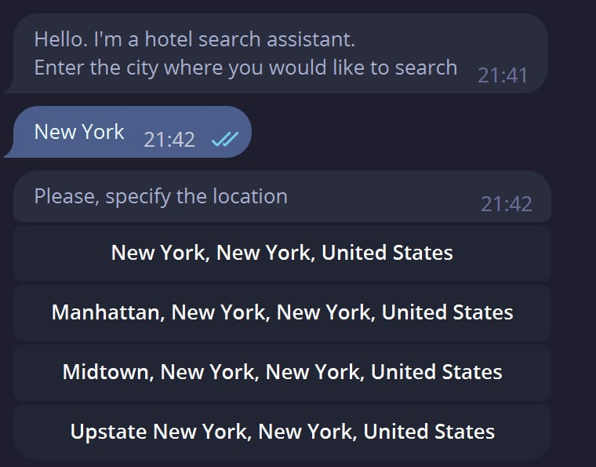
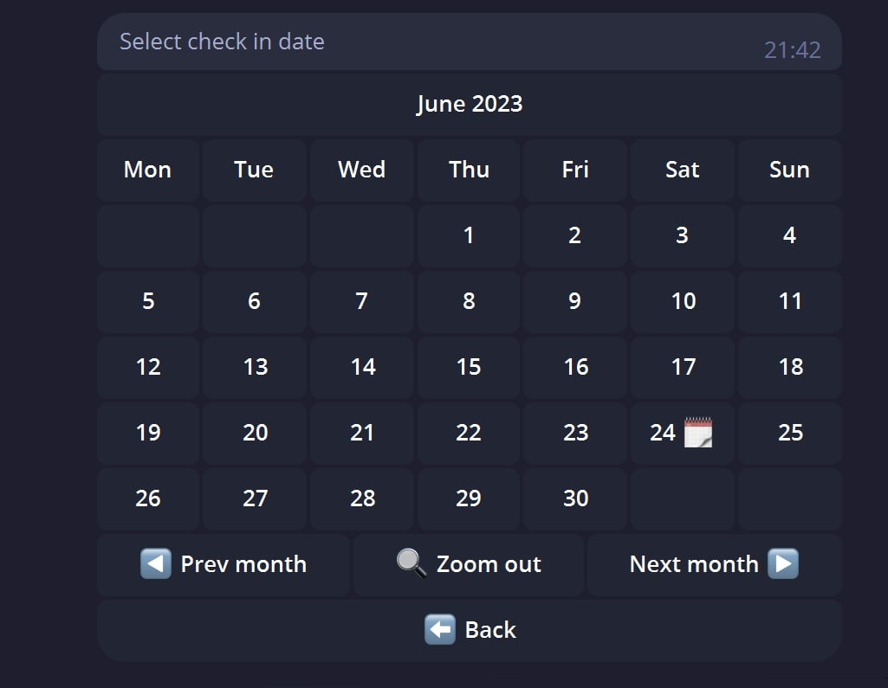
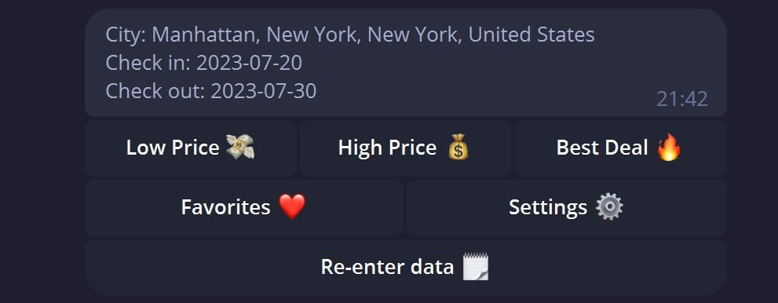
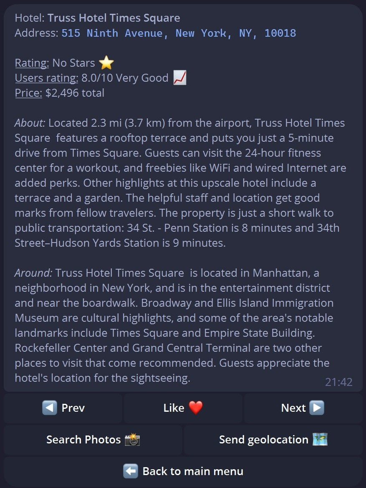
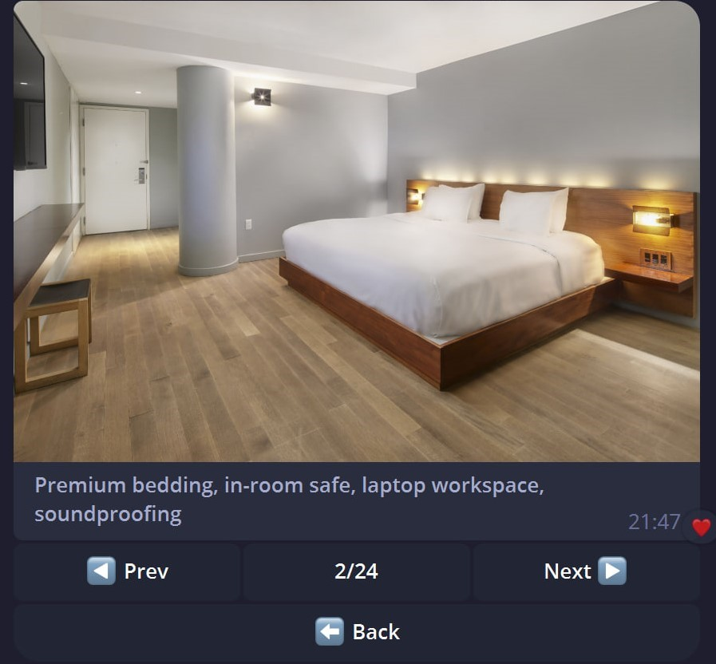

<html>

  <h1>
    <b>Telegram Hotels Search Bot</b>
  </h1>

  
  
  

    Это телеграмм бот, который позволяет искать отели в разных городах. Бот написан на aiogram с использованием aiogram-dialog, PostgreSQL, SQLAlchemy, Redis, HTTPX.
  

  <h2>
    <b>Особенности</b>
  </h2>
  <ul>
    <li>Поиск отелей в различных городах и странах, за исключением России.</li>
    <li>Выбор предположительной даты заезда/выезда.</li>
    <li>Фильтрация отелей по трем фильтрам:</li>
    <ul>
      <li>от дешёвых к дорогим</li>
      <li>от дорогих к дешёвый</li>
      <li>лучшие по соотношению цена/рейтинг/геопозиция</li>
    </ul>
    <li>Получение подробной информации об отеле (адресс, рейтинг, описание и т.д.)</li>
    <li>Расчитывание стоимости проживания относительно выбранных дат.</li>
    <li>Возможность загрузки геолокации с возможностью построить маршрут.</li>
    <li>Возможность сохранения выбранного отеля в избранное.</li>
    <li>Возможность динамической загрузки всех фотографий по выбранному отелю.</li>
  </ul>
  <h2>
    <b>Используемые библиотеки</b>
  </h2>
  
  | Название       | Версия   |
  | :---           | ---:     |
  | aiogram        | 3.0.0b7  |
  | aiogram-dialog | 2.0.0b18 |
  | redis          | 4.5.5    |
  | httpx          | 0.24.1   |
  | orjson         | 3.9.1    |
  | betterlogging  | 0.2.1    |
  | environs       | 9.5.0    |
  | orjson         | 3.9.1    |
  | SQLAlchemy     | 2.0.16   |
  | asyncpg        | 0.27.0   |
  <h2>
    <b>Установка</b>
  </h2>
  <ul>
    <li>
      

        Склонируйте репозиторий на свой локальный компьютер.
      

      <code>git clone https://github.com/3JloDey/python_hotels_chatbot.git</code>
    </li>
    <li>
      

        Установите зависимости используя команду.
      

      <code>pip install -r requirements.txt</code>
    </li>
    <li>
      

        Переименуйте файл <code>.env_template</code> в <code>.env</code> и заполните его по шаблону внутри.
      

    </li>
    <li>
      

        Запустите файл <code>main.py</code>.
      

    </li>
  </ul>
  <h2>
    <b>Пример работы</b>
  </h2>
  
Для начала работы с ботом необходимо ввести команду <code>/start</code>.

  

    После ввода команды бот запрашивает город.
  

  
  
После уточнения местоположения бот просит указать даты заезда и выезда.

  
  
После выбора даты появляется <i>"Главное меню"</i> 

  
Главное меню бота. Здесь доступны следующие функци:

  <ul>
    <li>Low Price - Поиск дешёвых отелей.</li>
    <li>High Price - Поиск дорогих отелей.</li>
    <li>Best Deal - Поиск лучших отелей.</li>
    <li>Favorites - Показать избранные отели.</li>
    <li>Settings - Меню настройки, где можно изменить город и даты.</li>
    <li>Re-enter data - Вернуться в начало поиска, сбросив запрос и начав заново.</li>
  </ul>
  
  
При выборе категории отелей, появляется "Карточка отеля", в которой отображается вся необходимая информация.

  
Карточка отеля:

  <ul>
    <li>Prev / Next - Кнопки переключения отелей.</li>
    <li>Like - Добавить в избранное.</li>
    <li>Search Photos - Открыть меню загрузки фотографий.</li>
    <li>Send geolocation - Прислать геолокацию отеля.</li>
    <li>Back to main menu - Вернуться в главное меню.</li>
  </ul>
  
  
При просмотре фотографий отеля поменяется меню со следующим функционалом:

  <ul>
    <li>Prev / Next - Кнопки переключения фотографий.</li>
    <li>Кнопка "счетчик" фотографий, которая находится между Prev и Next кнопками.</li>
    <li>Back - Назад к карточке отеля.</li>
  </ul>
  
</html>
